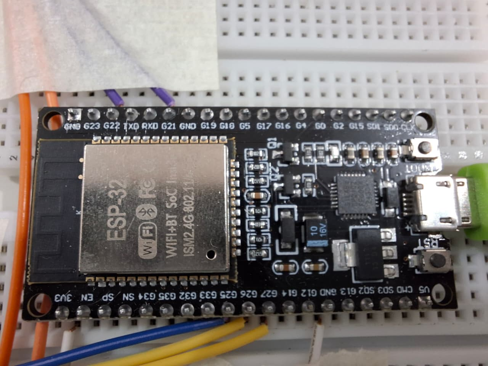
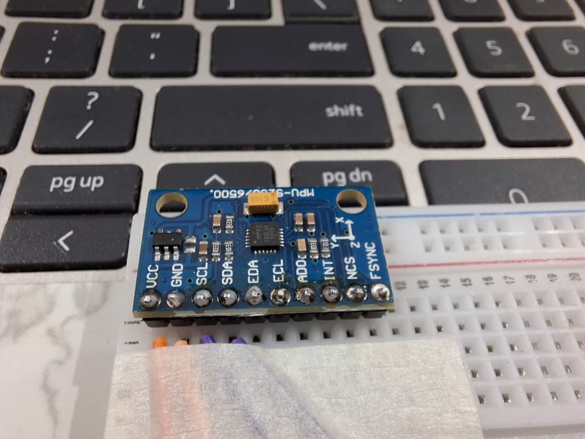
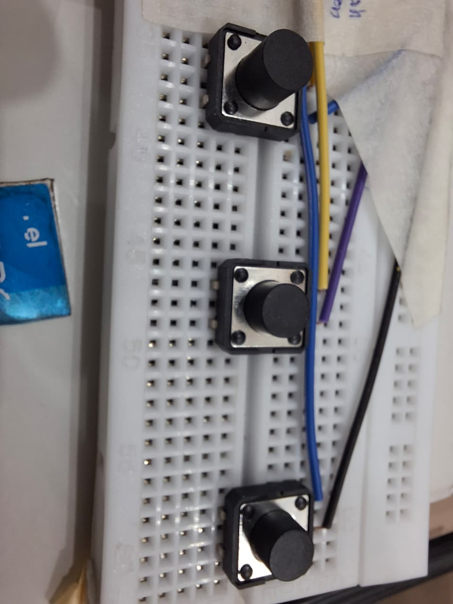
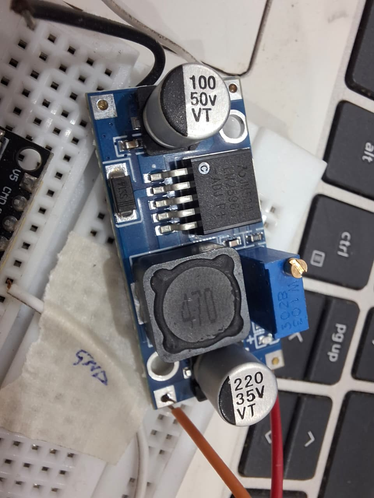
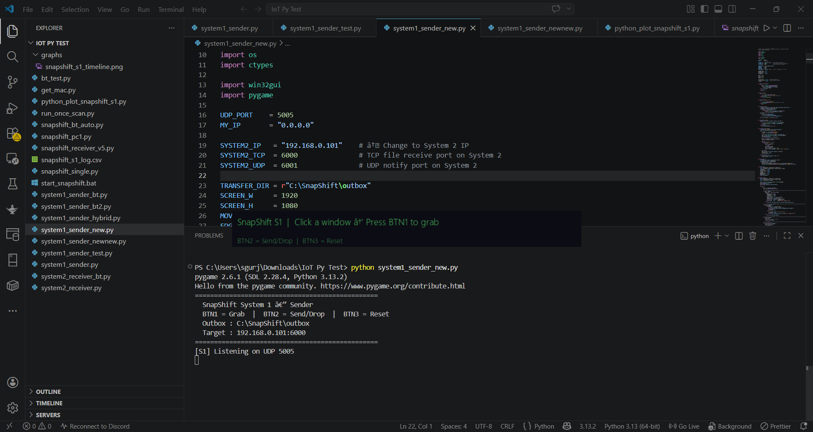
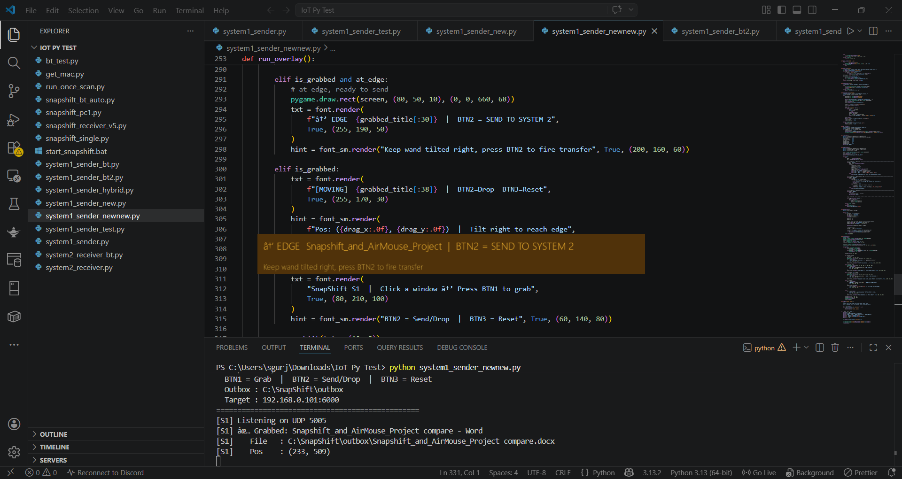
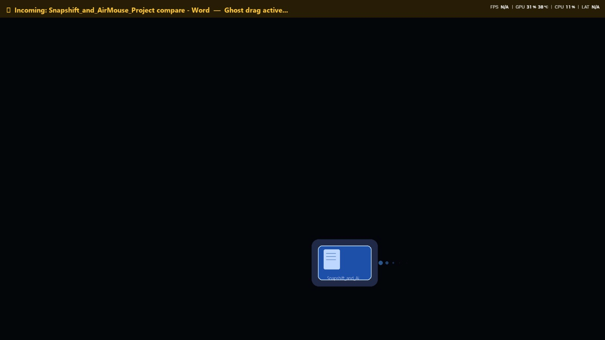
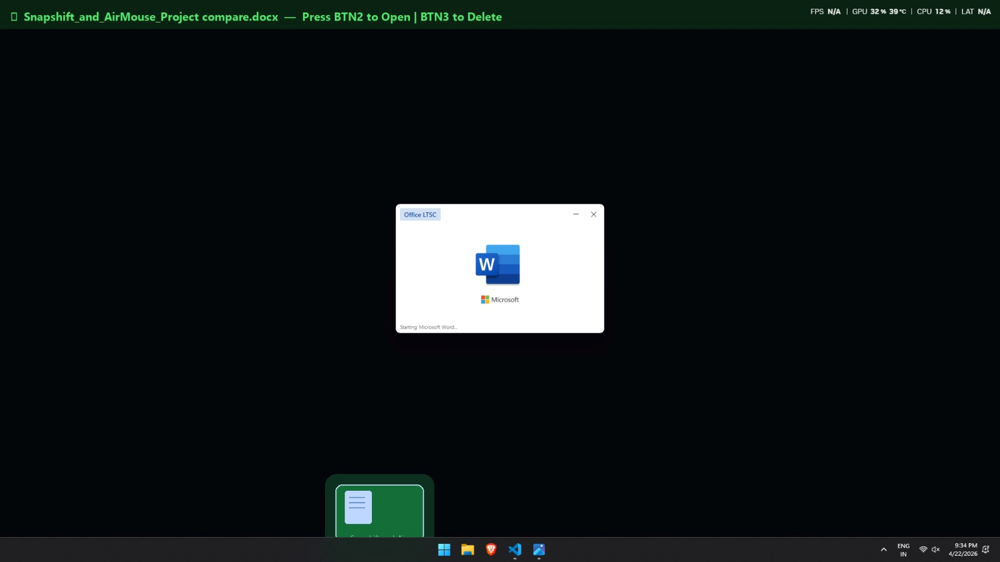

# SnapShift — Gesture-Driven Cross-System Wireless File Transfer

> IoT project that lets you “grab” a window on one Windows PC using an ESP32 wand, move it with hand motion, and wirelessly hand off the linked file to a second PC over Wi‑Fi — with live animated overlays on both systems.[file:509]

---


---

## 1. Overview

SnapShift is an IoT-based **gesture-driven file transfer ecosystem** built around an ESP32 Dev Module and an MPU9250 motion sensor.[file:509]  
The handheld wand lets a user physically **select a window on System 1, drag it across the screen with hand tilt, and “drop” it at the screen edge to send the associated file to System 2** — all over Wi‑Fi, without touching keyboard or mouse.[file:509]

The system combines:

- ESP32 + MPU9250 wand (I²C IMU + three buttons).
- Wi‑Fi UDP packets for live motion and button events to System 1.
- TCP streaming from System 1 to System 2 for reliable file transfer.
- Python + Pygame overlays on both systems to visualize the file “flying” across screens.[file:509]

---

## 2. Architecture

SnapShift is composed of three main parts.[file:509]

### 2.1 ESP32 Wand (Tracker Device)

- **ESP32 Dev Module (2.4 GHz Wi‑Fi)** as the core MCU.
- **MPU9250 IMU** connected over I²C (SDA = GPIO21, SCL = GPIO22).
- **Three push buttons** on:
  - GPIO25 → SELECT (pick up window & bind file)
  - GPIO26 → RELEASE (drop & send file)
  - GPIO27 → RESET (cancel and return to idle)[file:509]
- Reads gyro Y and Z axes at ~50 Hz, converts raw 16‑bit values to degrees-per-second using 131 LSB/°/s factor, and applies a ±0.8 °/s deadband filter to remove noise.[file:509]
- Sends messages like:
  - `SELECT`
  - `RELEASE`
  - `RESET`
  - `MOTION:gz:gy`  
    over **UDP** to System 1 (port 5005).[file:509]

_(Your Word document still mentions a hybrid Wi‑Fi + Bluetooth version. For this repo, we are focusing on the Wi‑Fi‑only path: ESP32 → Wi‑Fi UDP → System 1 → TCP → System 2.)_

### 2.2 System 1 — Windows Sender (`system1_sender.py`)

- Runs on Windows with Python 3.
- Listens for wand messages over **UDP port 5005**.
- On `SELECT`:
  - Grabs the currently focused window using `win32gui.GetForegroundWindow()`.
  - Reads its title and position.
  - Performs a fuzzy filename match in `C:\SnapShift\outbox` to bind a window to a specific file.[file:509]
- On `MOTION:gz:gy`:
  - Converts tilt into pixel deltas using configurable `MOVE_SENS`.
  - Moves the grabbed window using `win32gui.MoveWindow()` at ~60 FPS.
  - Detects when the window crosses the right edge (`EDGE_THRESH` = screen width − 160 px) and sends an `APPROACHING` UDP notify to System 2 on port 6001.[file:509]
- On `RELEASE` at edge:
  - Opens a **TCP connection** to System 2 (port 6000).
  - Sends `HANDOFF|filename|filesize` header, followed by raw file bytes in 4 KB chunks.
  - Sends `INCOMING` UDP notify to System 2 in parallel.[file:509]
- Shows a small Pygame overlay bar (top-left of screen) with colour‑coded states:
  - idle
  - moving
  - at-edge
  - uploading
  - sent[file:509]

### 2.3 System 2 — Windows Receiver (`system2_receiver_wifi-1-2.py`)

- Runs on Windows with Python 3.
- Threads:
  - **TCP file server** on port 6000 (handles `HANDOFF|filename|filesize` + file bytes, saves into `C:\SnapShift\inbox`).
  - **UDP notify listener** on port 6001 (handles `APPROACHING`, `INCOMING`, `RESET`).
  - **ESP32 UDP listener** on port 5007 (BTN2 to open file in Explorer, BTN3 to delete/reset).
  - **Animation ticker** for the file card slide‑in.[file:509]
- Shows a **full‑screen Pygame overlay** with:
  - A glowing file card sliding in from the right edge (velocity + damping “physics”).
  - A progress bar for incoming TCP bytes.
  - Final state where BTN2 opens the file and BTN3 deletes it.[file:509]

---

## 3. Features

From your final document, the current SnapShift build provides:[file:509]

- **Gesture-driven window movement**: Tilt‑based control of the active window using MPU9250 gyro data from the ESP32 wand.
- **File binding to window**: On SELECT, the sender script auto‑binds the currently focused window to a matching file in a staging folder.
- **Wi‑Fi‑only data path**: ESP32 sends motion and button events over Wi‑Fi UDP to System 1, which then uses TCP to stream files to System 2.
- **Edge-triggered handoff**: Moving the window beyond a configurable edge threshold triggers “approaching” and enables a RELEASE‑to‑send gesture.
- **Real-time status overlays**:
  - System 1: compact bar overlay (moving, at‑edge, uploading, sent).
  - System 2: full‑screen flying file card with progress bar and finalization prompt.
- **Noise filtering and scaling** on the ESP32 (deadband + gain) to damp hand tremors and give smooth, controllable motion.
- **Transport-agnostic receiver**: System 2 logic depends only on Wi‑Fi TCP/UDP messages from System 1, so the wand communication method can be swapped without changing receiver code.[file:509]

---

## 4. Hardware Setup

### 4.1 Components

- ESP32 Dev Module (Wi‑Fi)
  
- MPU9250 9‑axis motion sensor
  
- 3 × push buttons
  
- LM256 DC‑DC buck converter (9 V battery → 3.3 V rail)
  
- 9 V battery
- Jumper wires, breadboard or custom PCB[file:509]

### 4.2 Pin Connections

**MPU9250 → ESP32 (I²C)**

| ESP32 Pin | MPU9250 Pin | Function  |
| --------- | ----------- | --------- | ---------- |
| 3V3       | VCC         | Power     |
| GND       | GND         | Ground    |
| 22        | SCL         | I²C Clock |
| 21        | SDA         | I²C Data  | [file:509] |

**Buttons → ESP32**

| ESP32 Pin | Button   | Function    |
| --------- | -------- | ----------- | ---------- |
| G25       | Button 1 | Select File |
| G26       | Button 2 | Send File   |
| G27       | Button 3 | Reset       | [file:509] |

**Power**

| 9 V Battery | LM256 Output | Rail     | Function                                |
| ----------- | ------------ | -------- | --------------------------------------- | ---------- |
| +9 V        | 3.31 V       | +ve rail | Step down 9 V to 3.31 V for ESP32 + IMU |
| GND         | GND          | −ve rail | Common ground for the whole circuit     | [file:509] |

---

## 5. Software & Library Requirements

### 5.1 ESP32 Firmware (Arduino)

Libraries (Arduino IDE / PlatformIO):

- `Wire` (built‑in) — I²C communication with MPU9250.
- `WiFi` (built‑in ESP32 core) — connect to Wi‑Fi network and send UDP packets (SELECT, RELEASE, RESET, MOTION:gz:gy) to System 1.[file:509]

Make sure you have installed the **ESP32 board support package** in Arduino IDE.

### 5.2 System 1 — Windows Sender

Python 3 modules:

- `socket` (std lib) — UDP listener and TCP client.
- `threading`, `time`, `sys`, `os` (std lib) — threads + filesystem.
- `ctypes` (std lib) — keep overlay window on top.
- `pywin32` (`win32gui`) — window handle, position, and movement.
- `pygame` — overlay bar rendering.[file:509]

Install:

```bash
pip install pywin32 pygame
```

### 5.3 System 2 — Windows Receiver

Python 3 modules:

- `socket` (std lib) — TCP server (file bytes), UDP notify and ESP32 button ports.
- `threading`, `time`, `sys`, `os` — threads and file operations.
- `ctypes` — topmost full‑screen overlay.
- `subprocess` — open received file in Explorer.
- `pygame` — full‑screen flying file card animation.[file:509]

Install:

```bash
pip install pygame
```

---

## 6. Basic Setup & Run

> These are high‑level steps; see code comments for exact IPs and ports.

1. **ESP32**
   - Flash the ESP32 Wi‑Fi firmware.
   - Configure SSID/password and System 1 IP in the sketch.
   - Power the wand via LM256 + 9 V battery.

2. **System 1 (Sender)**
   - Place files to send in `C:\SnapShift\outbox`.
   - Edit `system1_sender.py` to set:
     - `SYSTEM2_IP` (receiver machine IP).
     - Ports (UDP 5005, TCP 6000, UDP 6001) if you changed defaults.
   - Run:
     ```bash
     python system1_sender.py
     ```

3. **System 2 (Receiver)**
   - Ensure `C:\SnapShift\inbox` exists (or script will create it).
   - Run:
     ```bash
     python system2_receiver_wifi-1-2.py
     ```

4. **Usage**
   - Focus a window on System 1 whose title roughly matches a file in `outbox`.
   - Press **Button 1 (SELECT)** on the wand to grab and bind.
   - Tilt wand to move the window; push it to the right edge until overlay shows **EDGE**.
   - Press **Button 2 (SEND)** to start transfer.
   - Watch System 2 overlay show **approaching → receiving → arrived**.
   - Press BTN2 (via ESP32 → System 2) to open the received file, or BTN3 to delete/reset.[file:509]

---

## 7. Output Screenshots

- **System 1 — Initialization**  
  

- **System 1 — Dragging file to edge**  
  

- **System 1 — File Sending**  
  

- **System 2 — Ghost Dragging Started on System 2**  
  

- **System 2 — Incoming + Receiving + Auto-open**  
  

---

## 8. License / Academic Note

> This project is part of an academic IoT major project and is under an ongoing patent discussion.  
> All rights reserved; source code is shared for review and educational reference only.
